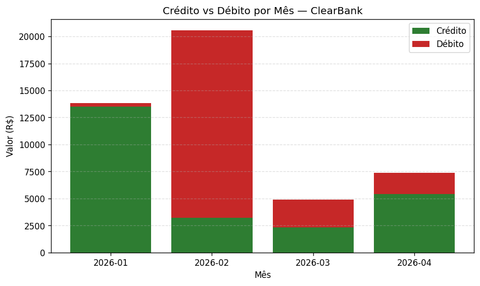

# ClearBank — Análise de Transações (Desafio Final · Fase 3)

Projeto do desafio final do módulo de Python para análise de dados. No papel
de **analista de dados júnior** da fintech fictícia **ClearBank**, o objetivo
é processar um arquivo de transações com dados "sujos": ler o CSV, **validar e
limpar** os registros, calcular **métricas mensais**, sinalizar **transações
suspeitas** (acima de R$ 10.000,00), exibir um relatório formatado no terminal
e exportar o resultado em `relatorio.json`.

## Stack

- **Python 3.10+** (testado em 3.12).
- Módulos **nativos**: `csv`, `json`, `datetime`, `collections`.
- **Opcionais**: `pandas` (RO1) e `matplotlib` (RO2).

```bash
pip install pandas matplotlib
```

## Como executar

### No Google Colab (recomendado)

1. Faça upload de `desafio-final.ipynb` **e** de `transacoes.csv`.
2. Menu **Ambiente de execução → Executar tudo**.
3. `pandas` e `matplotlib` já vêm instalados no Colab.

### No Jupyter local

```bash
cd desafio-pos-fase-3
pip install pandas matplotlib jupyter
jupyter notebook desafio-final.ipynb   # depois: Run → Run All Cells
```

### Análise com pandas via linha de comando (RO1)

```bash
python analise_pandas.py
```

## Saídas geradas

| Arquivo | Origem |
|---|---|
| `relatorio.json` | Gerado pela célula de execução principal do notebook |
| `grafico.png` | Gerado pela célula RO2 (matplotlib) |

Ambos estão versionados no repositório como exemplo do resultado de uma
execução completa — veja a seção a seguir.

## Resultado da execução

Os artefatos abaixo foram produzidos por uma execução do notebook sobre o
`transacoes.csv` deste repositório (20 linhas → **15 válidas**, **5 inválidas**,
período de 2026-01-05 a 2026-04-25).

### Gráfico — Crédito vs Débito por mês (RO2)



### Relatório no terminal

```
==================================================
        RELATÓRIO DE TRANSAÇÕES - CLEARBANK
==================================================
Período: 2026-01-05 até 2026-04-25 (110 dias)
Transações válidas:   15
Transações inválidas: 5
==================================================

--- 2026-01 ---
  Quantidade:    4
  Total crédito: R$ 13.500,00
  Total débito:  R$ 340,65
  Saldo:         R$ 13.159,35
  Média:         R$ 3.460,16
  Maior valor:   R$ 12.000,00 (id 4 - Transferencia recebida)
  Menor valor:   R$ 89,90 (id 3 - Conta de luz)
...
==================================================
        TRANSAÇÕES SUSPEITAS (> R$ 10.000,00)
==================================================
  [id 4] 2026-01-28 - C003 - R$ 12.000,00 - Transferencia recebida
  [id 7] 2026-02-15 - C001 - R$ 15.750,00 - Compra de equipamentos
```

### Trecho do `relatorio.json`

```json
{
  "gerado_em": "2026-06-02 13:14:54",
  "periodo": {
    "mais_antiga": "2026-01-05",
    "mais_recente": "2026-04-25"
  },
  "dias_periodo": 110,
  "total_transacoes_validas": 15,
  "total_transacoes_invalidas": 5,
  "resumo_mensal": {
    "2026-02": {
      "quantidade": 4,
      "total_credito": 3200.5,
      "total_debito": 17380.2,
      "saldo": -14179.7,
      "media": 5145.18,
      "maior_valor": { "id": 7, "valor": 15750.0, "descricao": "Compra de equipamentos" },
      "menor_valor": { "id": 8, "valor": 430.2, "descricao": "Posto de gasolina" }
    }
  },
  "suspeitas": [
    { "id": 4, "data": "2026-01-28", "cliente_id": "C003", "tipo": "credito", "valor": 12000.0, "descricao": "Transferencia recebida" },
    { "id": 7, "data": "2026-02-15", "cliente_id": "C001", "tipo": "debito", "valor": 15750.0, "descricao": "Compra de equipamentos" }
  ]
}
```

> O arquivo completo está em [`relatorio.json`](relatorio.json).

## Estrutura do repositório

```
desafio-pos-fase-3/
├── desafio-final.ipynb   # notebook principal (obrigatório)
├── transacoes.csv        # dataset de entrada (20 linhas: 15 válidas + 5 inválidas)
├── analise_pandas.py     # RO1 — análise alternativa com pandas (executável)
├── relatorio.json        # gerado pelo notebook
├── grafico.png           # gerado pelo notebook (RO2)
└── README.md             # este arquivo
```

## Regras de validação

Uma transação é considerada **válida** somente se passar em todas as regras:

| Campo | Regra |
|---|---|
| `id` | inteiro (apenas dígitos) |
| `cliente_id` | não vazio |
| `data` | formato `AAAA-MM-DD` (`datetime.strptime`) |
| `tipo` | `credito` ou `debito` |
| `valor` | número **positivo** (`> 0`) |

O dataset de exemplo inclui propositalmente 5 linhas inválidas — uma para cada
regra acima — para exercitar o tratamento de erros.

## Checklist de requisitos

**Obrigatórios**

- [x] Leitura de CSV com `csv.DictReader` (stdlib).
- [x] 6+ funções com responsabilidades separadas (`ler_transacoes`,
      `validar_data`, `validar_valor`, `validar_transacao`,
      `processar_transacoes`, `gerar_relatorio`, `salvar_json`,
      `exibir_relatorio`, `formatar_brl`).
- [x] 3 usos distintos de `try/except` específicos: `FileNotFoundError` na
      leitura, `ValueError` na conversão de data e na de valor.
- [x] Datas tratadas com `datetime.strptime` / `strftime`.
- [x] Métricas mensais: quantidade, total de crédito, total de débito, saldo,
      média, maior e menor transação.
- [x] Detecção de transações suspeitas (`LIMITE_SUSPEITO = 10000.00`).
- [x] Exportação para `relatorio.json` (`ensure_ascii=False, indent=2`).
- [x] Relatório formatado no terminal com separadores e valores em R$ (padrão BR).

**Opcionais**

- [x] **RO1** — análise mensal alternativa com `pandas` (notebook + `analise_pandas.py`).
- [x] **RO2** — gráfico de crédito vs débito por mês com `matplotlib` (`grafico.png`).
